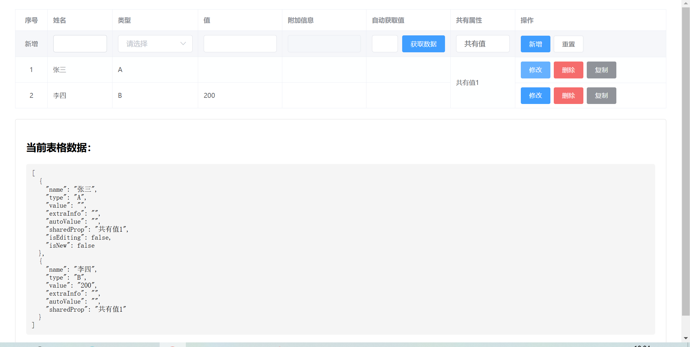

# Vue Editable Table

基于 Element ui 的可编辑表格组件，提供简单易用的单元格编辑功能。

## ✨ 功能特性

- 🚀 支持单元格编辑，单元格类型有下拉、输入、按钮获取、共有属性。
- 📊 与 Element ui Table 组件完全兼容
- 🎯 支持自定义验证规则
- 🎯 支持单元格之间配置逻辑关联回显

## 📝 组件属性

### EditableTable Props

| 属性名 | 说明 | 类型 | 默认值 |
|--------|------|------|--------|
| data | 表格数据 | Array | [] |
| columns | 列配置 | Array | [] |
| editTrigger | 触发编辑的方式 | 'dblclick' / 'click' | 'dblclick' |
| validateOnChange | 是否在值变化时验证 | Boolean | true |
| immediate | 是否立即进入编辑模式 | Boolean | false |

### Column 配置项

| 属性名 | 说明 | 类型 | 默认值 |
|--------|------|------|--------|
| prop | 列属性名称 | String | - |
| label | 列标题 | String | - |
| editable | 是否可编辑 | Boolean | false |
| rules | 验证规则 | Array | - |
| editor | 自定义编辑器组件 | Component | - |

## 🎯 事件

| 事件名 | 说明 | 参数 |
|--------|------|------|
| cell-change | 单元格值变化时触发 | (row, column, value) |
| edit-start | 开始编辑时触发 | (row, column) |
| edit-end | 结束编辑时触发 | (row, column) |
| validate-error | 验证失败时触发 | (error) |

## �� 高级示例

### 自定义验证规则